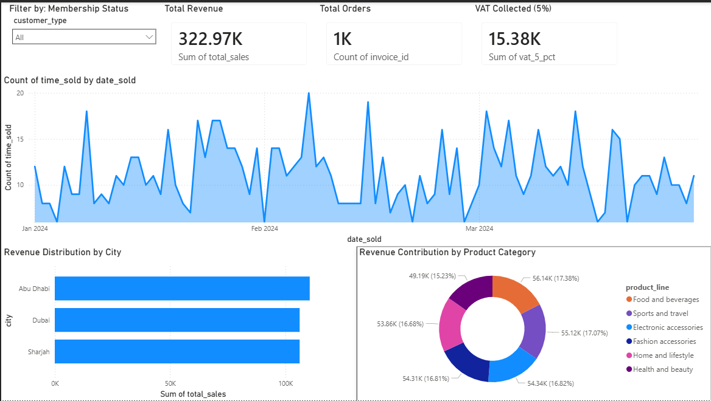
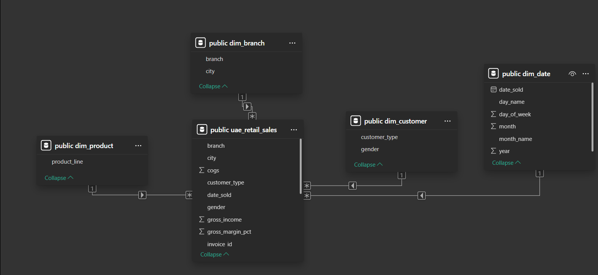
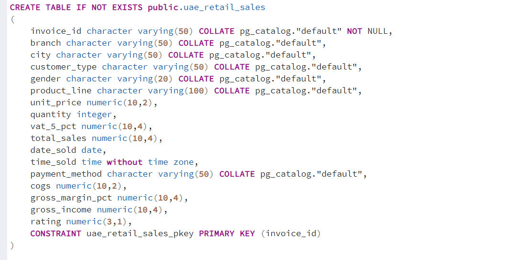

# 🇦🇪 UAE Retail Sales Analysis | End-to-End BI Project

## 📌 Project Overview
This project demonstrates a full data pipeline: from raw data ingestion to database management and executive-level visualization. I transformed a dataset of UAE retail transactions into an interactive Power BI dashboard to help stakeholders identify sales trends and regional performance.

## 🛠️ Tech Stack & Skills
* **Database:** PostgreSQL (Relational Data Modeling)
* **Tool:** Power BI Desktop (ETL, Star Schema, Data Visualization)
* **Language:** SQL (DDL for Table Creation, DML for Data Import)
* **Data Source:** Excel/CSV (Retail Transaction Records)

## 📊 Project Visuals

### **1. Executive Dashboard**

### **2. Data Model (Star Schema)**

### **3. SQL Database Structure**

## 🏗️ Data Architecture (The "Brain")
I designed a **Star Schema** to optimize query performance and reporting. This model connects a central **Fact Table** to four **Dimension Tables**:
* `uae_retail_sales` (Fact: Revenue, Tax, Quantity)
* `dim_date` (Dimension: Temporal analysis)
* `dim_product` (Dimension: Category & Pricing)
* `dim_branch` (Dimension: City-based performance)
* `dim_customer` (Dimension: Member vs. Normal classification)

## 💻 How to Use This Project
1.  **Database Setup:** Execute the `database_setup.sql` script in pgAdmin/PostgreSQL.
2.  **Visuals:** Open the `UAE_Retail_Dashboard.pbix` file in Power BI Desktop.
